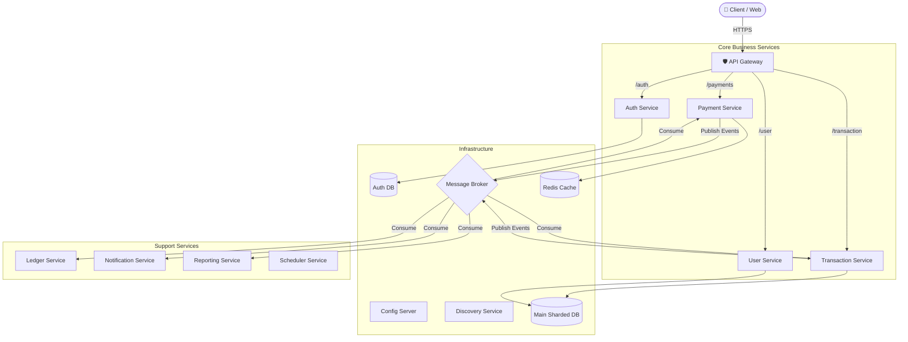
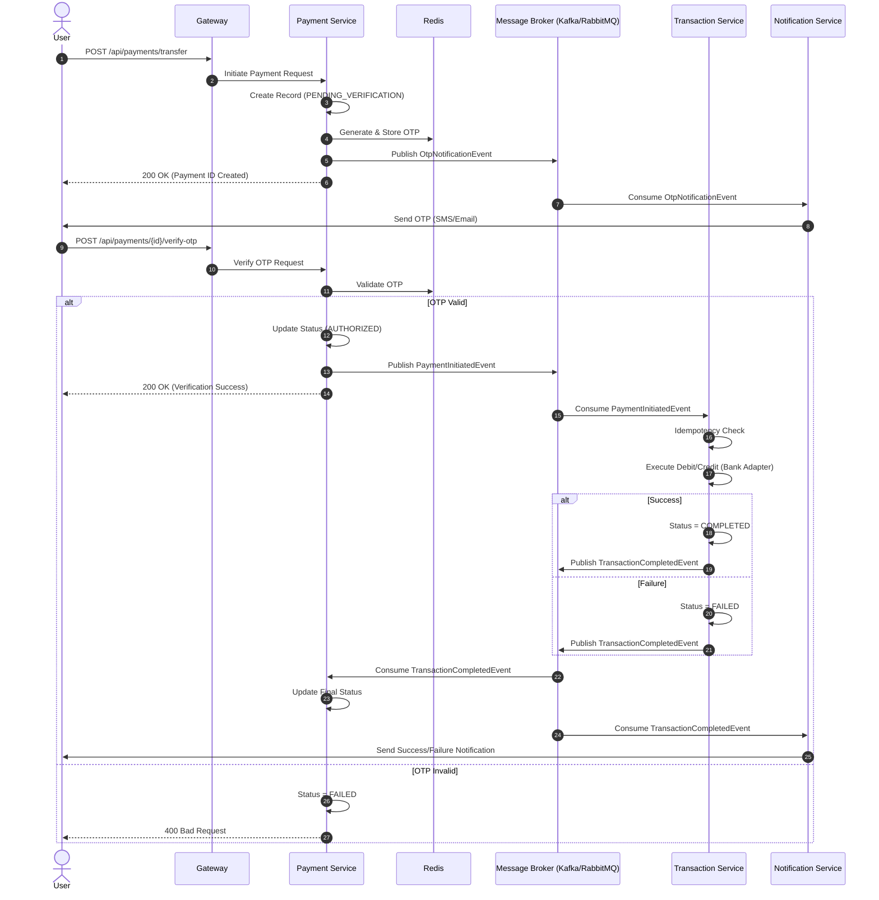

# 🏦 FinTech Microservices Platform

[](https://www.oracle.com/java/)
[](https://spring.io/projects/spring-boot)
[](https://www.docker.com/)
[](LICENSE)

A robust, N-Tier microservices architecture for a payment gateway system. Designed for high availability, scalability, and security, utilizing industry-standard patterns and tools.

---

## 🏗️ System Architecture

The system follows a reactive microservices architecture. The **API Gateway** acts as the single entry point, routing requests to specific services. Inter-service communication is primarily **Event-Driven** via a message broker to ensure loose coupling and high availability.

### High-Level Components



---

## 🔄 Transaction Flow

The transaction process is **asynchronous** and **event-driven**, ensuring that long-running processes do not block the user experience.

### 1. Payment Initiation & OTP Verification (Happy Path)



---

## 🚀 Services Overview

| Service | Port | Description |
| :--- | :--- | :--- |
| **Gateway Service** | `8080` | Entry point, routing, load balancing, and security filtering. |
| **Auth Service** | `8081` | User authentication, token generation (JWT), and authorization logic. |
| **User Service** | `8093` | Manages user profiles, KYC data, and preferences. |
| **Transaction Service** | `8086` | Core transaction processing logic. |
| **Payment Service** | `8084` | Integrates with external payment providers/gateways. |
| **Ledger Service** | `8087` | Double-entry bookkeeping and accounting records. |
| **Notification Service** | `8083` | Sends emails, SMS, and push notifications via events. |
| **Reporting Service** | `8092` | Generates analytics and financial reports. |
| **Scheduler Service** | `8089` | Manages recurring tasks and jobs. |
| **Retry Service** | `8090` | Handles failed transactions and retry policies. |
| **Config Server** | `8888` | Centralized configuration management. |

---

## 🛠️ Getting Started

### Prerequisites
- **Docker Desktop** (with Docker Compose v2.0+)
- **Java 21** (for local development/IDE)
- **Git**

### 🏁 Running the Platform

We provide a helper script `start.sh` in the `infra` directory to manage the lifecycle of the application.

1. **Clone the repository:**
   ```bash
   git clone <repository-url>
   cd fintech-project
   ```

2. **Start the Infrastructure and Services:**
   Navigate to the `infra` folder and run the start script.
   ```bash
   cd infra
   ./start.sh build
   ```
   *Note: The `build` argument forces a rebuild of the Docker images. Omit it to use existing images.*

3. **Verify Status:**
   Check the running containers:
   ```bash
   docker compose ps
   ```

### 🛑 Stopping the Platform
To gracefully stop all services and remove containers:
```bash
cd infra
./stop.sh
```

---

## 📊 Observability & Monitoring Dashboard

Once the stack is up and running, you can access the following dashboards:

| Tool | URL | Credentials (Default) |
| :--- | :--- | :--- |
| **Grafana** | [http://localhost:3000](http://localhost:3000) | `admin` / `admin` |
| **Prometheus** | [http://localhost:9090](http://localhost:9090) | N/A |
| **Jaeger UI** | [http://localhost:16686](http://localhost:16686) | N/A |
| **Splunk** | [http://localhost:8000](http://localhost:8000) | `admin` / `splunkpassword123` |
| **RabbitMQ** | [http://localhost:15672](http://localhost:15672) | `guest` / `guest` |

---

## 🔐 Security & Certificates

The project uses a Public Key Infrastructure (PKI) setup for secure communications.
- **Location**: `/certs` directory.
- **Files**:
  - `fintech.p12`: Server keystore for SSL.
  - `fintech-truststore.jks`: Truststore for verifying internal certificates.
  - `jwt-keystore.p12`: Keypair for signing JWTs.
  - `jwt-public.crt`: Public key for verifying JWT signatures.

> **Note:** For development, self-signed certificates are included. For production, ensure these are replaced with CA-signed certificates.

---

## 👨‍💻 Development

To run an individual service locally (e.g., inside IntelliJ IDEA):

1. **Ensure Infrastructure is Up**:
   Run `./start.sh infra` to start only databases, brokers, and config server.
   ```bash
   cd infra
   ./start.sh infra
   ```
2. **Configure Environment Variables**:
   Set the required env vars in your IDE run configuration (refer to `infra/.env` for values like `POSTGRES_USER`, `POSTGRES_PASSWORD`).
3. **Run the Application**:
   Start the `main` class of the desired service.

---

## 📄 License
This project is licensed under the MIT License.
